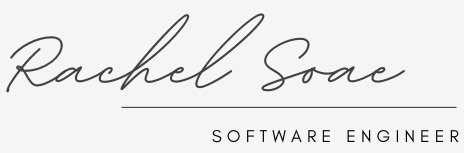

<!-- PROJECT LOGO -->
 

  

 

  <a href="https://www.rachelsoae.com">
    Click to Enter Site
  </a>

<!-- TABLE OF CONTENTS -->

## Table of Contents
  <ul>
    <li><a href="#built-with">Built With</a></li>
    <li><a href="#getting-started">Getting Started</a></li>
    <!-- <li><a href="#testing">Testing</a></li> -->
    <li><a href="#roadmap">Roadmap</a></li>
    <li><a href="#acknowledgments">Acknowledgments</a></li>
  </ul>

<!-- ABOUT THE SITE-->
## About the Site

### Built With

![JavaScript][JavaScript]
[![React][React]][React-url]
[![Sass][Sass]][Sass-url]
[![Cypress][Cypress]][Cypress-url]

(<a href="#readme-top">back to top</a>)

<!-- GETTING STARTED -->
## Getting Started

To demo this site on your local machine, follow these steps:

1. Clone down this repository
1. `cd` into the directory
1. Run `npm i` to install dependencies
1. Run `npm  start` to view live in your browser

(<a href="#readme-top">back to top</a>)

<!-- Testing -->
<!-- ## Testing

After installation, run `npm run cypress open` to view and run the test suite. *All tests passing at time of writing.*

(<a href="#readme-top">back to top</a>)

<!-- Roadmap -->
## Roadmap
Additional features, functionality, and potential refactors:
  * UI Testing
  * Advanced UI features, such as dark mode

(<a href="#readme-top">back to top</a>)

<!-- ACKNOWLEDGMENTS -->
## Acknowledgments

Huge thanks go out to [Laura Garcia Guerra](https://www.lauragarciaguerra.com/) for your invaluable advice and code reviews!

(<a href="#readme-top">back to top</a>)

<!-- MARKDOWN LINKS & IMAGES -->
<!-- https://www.markdownguide.org/basic-syntax/#reference-style-links -->
[linkedin-shield]: https://img.shields.io/badge/LinkedIn-0077B5?style=for-the-badge&logo=linkedin&logoColor=white
[rachel-li-url]: https://www.linkedin.com/in/rachel-soae-prather/
[Github]: https://img.shields.io/badge/GitHub-100000?style=for-the-badge&logo=github&logoColor=white
[rachel-gh-url]: https://github.com/rachelsoae
[JavaScript]: https://img.shields.io/badge/JavaScript-%23F7DF1E?style=for-the-badge&logo=javascript&logoColor=black
[React]: https://img.shields.io/badge/React-%2361DAFB?style=for-the-badge&logo=react&logoColor=black
[React-url]: https://react.dev/
[Sass]: https://img.shields.io/badge/Sass-%23CC6699?style=for-the-badge&logo=sass&logoColor=white
[Sass-url]: https://sass-lang.com/
[Cypress]: https://img.shields.io/badge/Cypress-%2317202C?style=for-the-badge&logo=cypress&logoColor=white
[Cypress-url]: https://docs.cypress.io/guides/overview/why-cypress

